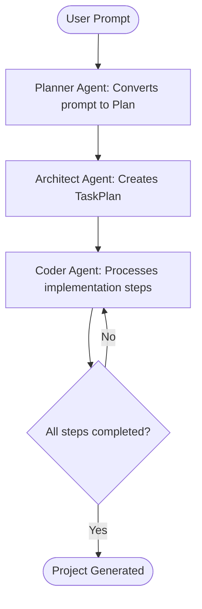

# Web Builder

An AI-powered web development assistant built with LangGraph and OpenAI. This tool leverages advanced language models to automate website creation, file management, and project scaffolding within a secure, sandboxed environment.

## Workflow

The Web Builder uses a LangGraph-based architecture to process user requests through a series of AI agents. Below is a visual representation of the workflow:



- **Planner Agent**: Analyzes the user's prompt and generates a high-level plan.
- **Architect Agent**: Breaks down the plan into actionable tasks.
- **Coder Agent**: Executes each task using tools to generate and modify files. It iterates until all tasks are complete.

This modular design ensures a structured and iterative approach to web development.

1. **Clone the Repository** (if applicable):
   ```bash
   git clone <repository-url>
   cd web-builder
   ```

2. **Set Up Virtual Environment**:
   ```bash
   python -m venv venv
   source venv/bin/activate  # On Windows: venv\Scripts\activate
   ```

4. **Install Server Dependencies**:
   ```bash
   pip install fastapi uvicorn
   ```
   (Note: These are already included in requirements.txt)

## Configuration

1. **Environment Variables**:
   - Copy `.env.example` to `.env` (if provided) or create a new `.env` file in the `agent/` directory.
   - Add your OpenAI API key:
     ```
     OPENAI_API_KEY=your_openai_api_key_here
     ```
   - Ensure other necessary variables (e.g., for LangSmith or additional services) are configured as needed.

2. **Project Root Initialization**:
   - The agent dynamically sets `PROJECT_ROOT` for secure file operations. Ensure your working directory is correctly configured.

## Running the Server

The application includes a FastAPI server that provides REST API endpoints for building websites asynchronously.

1. **Start the Server**:
   ```bash
   uvicorn agent.api:app --host 0.0.0.0 --port 8000 --reload
   ```
   - Access the API at `http://localhost:8000` or your configured host/port.
   - The server includes CORS middleware for frontend integration.

2. **API Endpoints**:
   - `GET /`: Health check endpoint.
   - `POST /api/build-website`: Submit a user prompt to start building a website asynchronously. Returns a `task_id`.
   - `GET /api/status/{task_id}`: Check the status and progress of a build task.
   - `GET /api/result/{task_id}`: Get the final result of a completed build, including project path and files.
   - `GET /api/download/{task_id}`: Download the generated project as a ZIP file.
   - `GET /api/file/{task_id}/{file_path}`: Retrieve the content of a specific file from the project.
   - `DELETE /api/task/{task_id}`: Delete a task and its associated project files.
   - `GET /api/tasks`: List all tasks (for debugging).

3. **Example Usage**:
   - Send a POST request to `/api/build-website` with JSON: `{"user_prompt": "Create a simple portfolio website"}`.
   - Use the returned `task_id` to poll `/api/status/{task_id}` until the status is "completed".
   - Then, download or access files via the other endpoints.

## Usage (Direct Agent Execution)\n\nFor direct execution without the API server:\n\n1. **Run the Agent**:\n   - Navigate to the project root and execute the main script:\n     ```bash\n     python agent/main.py  # Entry point for direct execution\n     ```\n   - Interact with the agent via prompts or input to describe the website you want to build.\n\n2. **Generate Projects**:\n   - The agent will create new project directories (e.g., `generated_project_1`) containing generated files, HTML, CSS, JavaScript, and other assets based on your specifications.\n   - Use the provided tools for file creation, editing, and command execution within the secure boundaries.\n\n3. **Monitor Logs**:\n   - Check `agent_execution.log` for detailed execution history and any errors.\n\n## Project Structure

```
web-builder/
├── agent/
│   ├── api.py            # FastAPI server for REST API endpoints
│   ├── main.py           # Entry point for direct agent execution
│   ├── graph.py          # Main LangGraph workflow definition
│   ├── tools.py          # File system and utility tools
│   ├── prompts.py        # Prompt templates for the AI agent
│   ├── states.py         # State management for the graph
│   └── .env              # Environment configuration
├── generated_project_*/  # Output directories for generated projects
├── requirements.txt      # Python dependencies (includes FastAPI, Uvicorn)
└── README.md             # This file
```

## Dependencies

- **LangChain & LangGraph**: For building the AI agent and workflow.
- **OpenAI**: For language model interactions.
- **FastAPI & Uvicorn**: For building and running the REST API server.
- **Python-DotEnv**: For loading environment variables.
- **Pydantic**: For data validation.
- **LangSmith**: For tracing and debugging (optional but recommended).
- **Pathlib2**: For additional path utilities.

## Contributing

1. Fork the repository.
2. Create a feature branch (`git checkout -b feature/AmazingFeature`).
3. Commit your changes (`git commit -m 'Add some AmazingFeature'`).
4. Push to the branch (`git push origin feature/AmazingFeature`).
5. Open a Pull Request.

## License

This project is licensed under the MIT License - see the [LICENSE](LICENSE) file for details.

## Support

For issues or questions, please open an issue on the repository or refer to the execution logs for debugging information.

---

*Built with ❤️ using LangGraph and OpenAI.*
